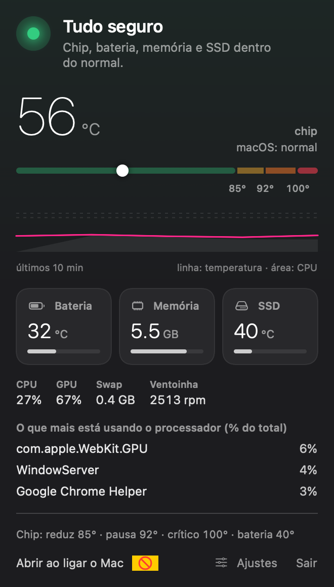

<p align="center"></p>

<h1 align="center">Brasa: monitor de temperatura do Mac na barra de menus (Apple Silicon)</h1>

<p align="center"><b>App gratuito e de código aberto que vigia a temperatura do chip, da bateria e do SSD, a memória e as ventoinhas do seu Mac, e avisa antes de ele superaquecer. Sem sudo. Sem telemetria.</b></p>

<p align="center"></p>

A Brasa mora na barra de menus do Mac e responde a uma pergunta: **o meu Mac está quente demais agora?** Ela lê os sensores do
Apple Silicon (chip, bateria, SSD), a pressão de memória e o swap, o uso de CPU e GPU, as ventoinhas e o estado térmico do macOS, transforma
tudo em quatro níveis claros e diz, em palavras simples, a hora de parar um render, uma exportação ou um build pesado. O ícone da pedra na barra
muda de cor com o estado do Mac, e você recebe uma notificação quando ele esquenta e quando esfria.

**Multi-idioma:** a interface existe em **English, Português (Brasil) e Español**. Ela segue o idioma do seu Mac e você troca em Ajustes.

[English README](README.md)

## Recursos

- **Temperatura do chip no Apple Silicon (M1 a M4), sem `sudo`.** Os sensores são lidos dentro do app via IOKit; não há ferramenta auxiliar nem pedido de senha.
- **Quatro níveis** (seguro, esquentando, quente demais, crítico) com o motivo e o próximo passo.
- **Pedra na barra de menus** que muda de cor com o estado, com os valores de chip, bateria e memória livre.
- **Temperatura da bateria e do SSD**, **pressão de memória e swap**, **uso de CPU e GPU**, **ventoinhas** e **estado térmico do macOS**.
- **Gráfico de 10 minutos** e os **processos que mais esquentam** (lidos só com o painel aberto).
- **Limites ajustáveis** e notificações, com margem de resfriamento para os avisos não ficarem oscilando no limite.
- **Abre ao ligar o Mac** e **privada por design**: nenhuma requisição de rede, nenhum analytics.

<p align="center"></p>

## Instalação

Por enquanto a Brasa é compilada a partir do código (o download notarizado está no roteiro). Só precisa das Command Line Tools do Xcode.

```bash
xcode-select --install            # uma vez, se ainda não tiver
git clone https://github.com/renatoalves-me/brasa.git
cd brasa
./build.sh                        # compila e instala em ~/Applications/Brasa.app
open ~/Applications/Brasa.app
```

Requisitos: um Mac com Apple Silicon e macOS 14 (Sonoma) ou mais novo. Macs Intel não são suportados.

## Os quatro níveis

| Nível | Padrão do chip | O que a Brasa diz |
|---|---|---|
| Seguro | abaixo de 85 °C | Tudo dentro do normal. |
| Esquentando | a partir de 85 °C | Evite começar render ou exportação agora. |
| Quente demais | a partir de 92 °C | Pause o trabalho pesado até baixar de 80 °C. |
| Crítico | a partir de 100 °C, ou macOS reduzindo forte a velocidade | Feche o que está pesando agora. |

Bateria (40 / 45 °C), SSD (70 / 80 °C) e a pressão de memória também elevam o nível.

## Ajustes: os seus limites

Os números acima são só o **padrão**. Em **Ajustes**, no rodapé do painel, você muda os limites do chip, da bateria, do SSD, do swap e dos processos em
destaque, e liga ou desliga notificações e som. Os limites mantêm a ordem sozinhos, cada um tem "voltar ao padrão" e existe "restaurar todos os padrões".

## Perguntas frequentes

**Precisa de sudo?** Não. Sem senha e sem ferramenta com privilégios.

**Quais Macs funcionam?** Apple Silicon (M1 a M4) com macOS 14+. Foi desenvolvida num MacBook Pro com M4 Pro; os nomes dos sensores podem variar entre chips, então
[abra uma issue](https://github.com/renatoalves-me/brasa/issues) com o seu modelo se algum valor parecer errado.

**Controla as ventoinhas?** Não, é só um monitor.

**Envia dados para algum lugar?** Não. O app não faz requisições de rede e não tem analytics.

## Apoie

A Brasa é gratuita e de código aberto. Se ela livrou você de um Mac superaquecido, ajude a manter o projeto:

[](https://ko-fi.com/H1T528G4KQ)

O GitHub Sponsors será adicionado em breve.

## Licença

[MIT](LICENSE) © 2026 Renato Alves.
